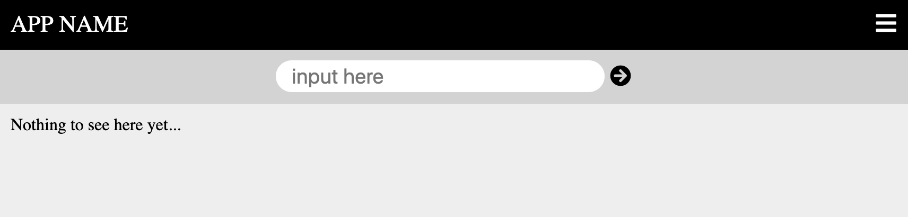

# Applying JavaScript to a Web App

#### Summary and Objectives
In this activity you will step through methods for changing the browser view of the HTML dynamically with JavaScript programming. You will primarily use variables (as Strings and Arrays), for-loops, and built-in functions to change the browser view.

## INSTRUCTIONS

### 1 - Get the Starter Code

The code below assumes you will use the filenames `index.html`, `style.css`, and `script.js` in the same folder, like the default setup in [Repl.it](https://repl.it). We will start with an empty JavaScript file (script.js).

**HTML**

Replace your HTML with the following.

```html
<!DOCTYPE html>
<html>

<head>
    <meta charset="utf-8">
    <meta name="viewport" content="width=device-width">
    <title>repl.it</title>
    <link href="https://use.fontawesome.com/releases/v5.7.2/css/all.css" rel="stylesheet">
    <link href="style.css" rel="stylesheet" type="text/css" />
</head>

<body>
    <div class="app">
        <div class="nav-bar">
            <div class="nav-left">APP NAME</div>
            <div class="nav-right"><i class="fas fa-bars"></i></div>
        </div>
        <div class="main-section">
            <div class="actions">
                <input class="main-input" placeholder="input here" size="30">
                <i class="fas fa-arrow-circle-right"> </i>
            </div>
            <!--------------------------------------->
            <!-- OUR PROGRAM RESULTS WILL GO BELOW -->
            <!--------------------------------------->
            <div class="collection" id="results">
                Nothing to see here yet...
            </div>
            <!--------------------------------------->
            <!--------------------------------------->
            <!--------------------------------------->
        </div>
    </div>
    <script src="script.js"></script>
</body>

</html>
```

**CSS**

```css
body {
  margin: 0;
  background: #eee;
}

.nav-bar {
  display: grid;
  grid-template-columns: 1fr 1fr;
  position: sticky;
  top: 0;
  background: black;
  color: white;
  padding: 11px;
  font-size: 22px;
}

.nav-right {
  text-align: right;
}

.actions {
  text-align: center;
  padding: 10px;
  background: lightgray;
  font-size: 20px;
  line-height: 30px;
}

.main-input {
  border: none;
  outline: none;
  border-radius: 99px;
  font-size: 20px;
  line-height: 30px;
  padding: 0px 15px;
}

.collection {
  display: grid;
  grid-template-columns: 1fr 1fr 1fr;
  grid-gap: 10px;
  padding: 11px;
  margin: auto;
  max-width: 900px;
}

.item {
  display: grid;
  background: white;
  box-shadow: 1px 1px 5px black;
}

.item-content {
  border-bottom: 1px solid lightgray;
  height: 150px;
  background-color: #00a;
  color: white;
  padding: 7px;
}

.item-actions {
  display: grid;
  height: 50px;
  justify-items: center;
  align-items: center;
  grid-template-columns: 1fr 1fr 1fr;
}

@media only screen and (max-width: 600px) {
  .collection {
    grid-template-columns: 1fr;
  }
}
```

> <i class="fas fa-check-circle"></i> **CHECKPOINT**
> 
> When you run the application in the browser you should see a result similar to the one below.
> 
> 

&nbsp;

### 2 - Use JavaScript to Insert a Line of Text

Notice that are starting code is basically like our last exercise with CSS grids with a subtle difference. Look in your HTML and find the following chunk of code.

```html
<!--------------------------------------->
<!-- OUR PROGRAM RESULTS WILL GO BELOW -->
<!--------------------------------------->
<div class="collection" id="results">
    Nothing to see here yet...
</div>
<!--------------------------------------->
<!--------------------------------------->
<!--------------------------------------->
```

First of all, those lines that start with `<!--` and end with `-->` are just comments that do not affect the output. Comments just help people looking at the code.  You will notice that the `div` tag for our *collection* not only has a class, as before, but now has an *id* of *results*. ID's are similar to *classes* but are intended to identify one element rather than a type (or class) of elements for styling. The *id* will be used to select an element in the JavaScript to manipulate it.

In your JavaScript (script.js) insert the following line of code and run it.

```js
document.querySelector("#results").innerHTML = "Hello World";
```

You should see "Hello World" on your web page view now. It has been inserted inside your *results* element. Let's break down how that one line of code works.

- `document` is a JavaScript object that provides many useful methods to work with the HTML (the document). The period `.` can then be followed with one of many methods or properties for the document.
- `querySelector("#results")` is a method to basically go find an HTML element with an *id* of *results*. The `#` denotes an *id*, just like how you used `.` in CSS to prefix a class selector.
- `innerHTML` allows you to either *read* the HTML inside that element or *set* the HTML to something else. Here we set the HTML to be "Hello World". Note: Strings (a group of characters) need to have quotations around them.

Go ahead and change the *string* to something else. You can also use numbers without quotations and even do some math. Try `3 + 2`. You should see 5 in your web page view.

&nbsp;

### 3 - Let's use a Variable

Now replace your line of JavaScript with the following.

```js
var myOutput = "Hello World, again.";

document.querySelector("#results").innerHTML = myOutput;
```

Here we are creating a *variable* called *myOutput* and setting it to "Hello World, again.". Then we can use the variable name, `myOutput` to set the *innerHTML* of our element. It may seem like we actually made things more complicated but variables will prove to be indispensible for you.

A variable's contents can be changed in the program. Try putting `myOutput = "Good Bye.";` in between the two lines of code you have. Once you run this in the browser view you will see the latest value of `myOutput` is what gets displayed. 

> Notice that we did not use `var` this second time. We only use `var` to define something as a variable the first time. After that we just use the name of the variable to refer to it.

We can even use HTML in our variable. Let's use HTML like we did for our grid items in our last lab. Replace all your JavaScript with the following code. Yep, replace **it all** with this.

```js
var myOutput = "<div class='item'><div class='item-content'>Look at me.</div></div>";
myOutput += "<div class='item'><div class='item-content'>And me too.</div></div>"
document.querySelector("#results").innerHTML = myOutput;
```

Once you run this, you should see two grid items displayed. Notice that we used `+=` to add the second element. This operator simply takes the variable's original value and adds the second value. 

**Try adding a third element of your own.**

> By the way, this (`+=`) is very useful for creating a number counter too.

So, if we had 200 items to display we could just keep repeating this, but that would be tedious. There is a much more efficent way to do it. Let's get started with that.

### 4 - Using an Array

An array can store multiple values in a variable. For example, we could define a list of content that we would like to display in our grid like this:

```js
var myData = ["Go to grocery.", "Call mom.", "Take dog to vet.", "Pay bills."];
```

The array uses *brackets* `[` `]` with the items listed with commas between. As usual, Strings should have quotation marks, but numbers don't. We can access the first element in the array like this `myData[0]`, where the *0* is called the *index* of the array. Array indices start with 0 then count up. So `myData[0]` would be "Go to grocery" and `myData[1]` would be "Call mom." and so on. It takes time to get used to arrays.

Replace all of your Javascript with the following.

```js
var myData = ["Go to grocery.", "Call mom.", "Take dog to vet.", "Pay bills."];
var myOutput = "";

myData.forEach(function (item){
  myOutput += "<div class='item'><div class='item-content'>" + item + "</div></div>";
});

document.querySelector("#results").innerHTML = myOutput;
```


### 5 - Using a Template Literal

[Template literals](https://css-tricks.com/template-literals/) are very useful, and at first they will seem like the strings we have already been using. But they are much more powerful. Replace all your javascript with the code below.

```js
var myData = ["Go to grocery.", "Call mom.", "Take dog to vet.", "Pay bills."];
var myOutput = "";

myData.forEach(function (item){
  myOutput += `
  <div class="item">
    <div class="item-content">
      ${item}
    </div>
    <div class="item-actions">
      <i class="fas fa-star"></i>
      <i class="fas fa-share"></i>
      <i class="fas fa-trash"></i>
    </div>
  </div>`;
});

document.querySelector("#results").innerHTML = myOutput;
```
Once you run this in your browser view you should four items in our collection. Let's identfiy a few things going on here.
1. We use a template for `myOutput`. Notice that this uses *backticks* (&#96;) instead of quotation marks. You can find this in the upper-lefthand corner of most keyboards.
2. The template allows you to use several lines with your string, rather than keeping everything on the same line. Which is great for including complex HTML.
3. The template allows us to use *expressions* like `${myData}` to insert a content within the string easily.

### Let's Stop Here

While the code may be challenging now, with time it will make more and more sense. Later we will work through how to allow a user to add content through the HTML input element. 


