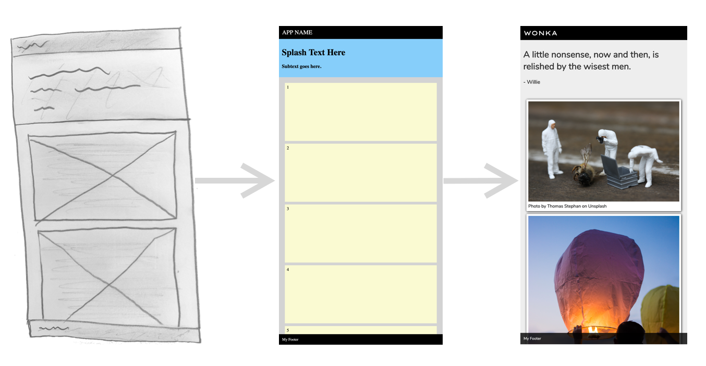

# Web App Intro



#### Summary and Objective
For this exercise you will begin with a basic HTML/CSS template for a web application and proceed to customize the content and style to your preference. Through the process you will acquire a basic intuition about HTML and CSS.

#### Recommended
Review the following material on w3schools.com beforehand.
- [https://www.w3schools.com/html/default.asp](https://www.w3schools.com/html/default.asp)  (First six sections to “Attributes” shown on left-hand menu)
- [https://www.w3schools.com/css/default.asp](https://www.w3schools.com/css/default.asp)  (First five sections shown on left-hand menu)

## INSTRUCTIONS

### 1 Get the Template Code

**HTML**

Copy the following HTML into the `body` of a standard HTML file or directly into the HTML section of Codepen.

```html
<div class="app">
  <div class="nav-bar">
    APP NAME
  </div>
  <div class="main-section">
    <div class="splash">
      <h1>Splash Text Here</h1>
      <h3>Subtext goes here.</h3>
    </div>
    <div class="collection">
      <div class="item">1</div>
      <div class="item">2</div>
      <div class="item">3</div>
      <div class="item">4</div>
      <div class="item">5</div>
      <div class="item">6</div>
      <div class="item">7</div>
      <div class="item">8</div>
    </div>
  </div>
  <div class="footer">My Footer</div>
</div>
```

**CSS**

Copy the following CSS into a stylesheet file linked in your HTML or directly into the CSS section of Codepen.

```css
body {
  margin: 0;
}

.nav-bar {
  position: sticky;
  top: 0;
  background: black;
  color: white;
  padding: 11px;
  font-size: 22px;
}

.footer {
  position: sticky;
  bottom: 0;
  background: black;
  color: white;
  padding: 11px;
  font-size: 14px;
}

.splash {
  padding: 10px;
  background: lightskyblue;
}

.collection {
  background: lightgray;
  padding: 11px;
}

.item {
  background: lightgoldenrodyellow;
  min-height: 200px;
  margin: 10px;
  padding: 7px;
}
```

You should be able to preview the web page and see the template that looks like the middle image shown at the top of this page.

### 2 Play Around with the Code a Bit

Now, try editing HTML content and CSS styles to see how it changes the browser view. Some changes won't be evident, others will. Don't worry about breaking anything. Remember, you can always restart with the code above. If you are pretty new to HTML and CSS, try the following changes.

- Change some text in the HTML content, like the app name or splash text.
- Change some colors in the CSS. Stick to common color names for now, like red, green, yellow, etc.
- Change some numbers in the CSS where you see `margin`, `padding`, `width`, `top`, `bottom`.

Ultimately, develop a sense of the components of this template, but you don't have to understand everything completely.

**IMPORTANT: Notice how the attribute `class` is used in the HTML elements and the matching CSS selecter is the same name with a *period* preceeding it. We won't get into the details of this now, but develop an intuition of that connection.**

> **The following items don't have to be done in a particular order**

### 3 Modify the Color Scheme to Your Preference

Now let's make some intentional changes. Experiment with differenct combinations of background colors and text colors. You can use color pallete sites, [like this one](https://coolors.co/browser/best/1), to give you ideas. You'll may notice there are three common ways to define colors in CSS.

- `color: red;` using common names
- `color: #FF0000;` using HEX
- `color: rgb(255,0,0)` using RGB

We won't cover the technical details of HEX and RGB here, but you can still copy them from color codes you find on the web.

### 4 Change the Font Family of Elements

One of the best way to add new fonts is using [Google Fonts](https://fonts.google.com/). Once you select fonts you like there, you will be provided the code you need to insert into your HTML `<head>` and CSS properties you can use. Examples below.

```html
<link href="https://fonts.googleapis.com/css?family=Lexend+Zetta|Nunito&display=swap" rel="stylesheet">
```

```css
font-family: 'Lexend Zetta', sans-serif;
```

### 5 Consider Applying Other CSS Properties

CSS offers a multitude of options for styling your web content. Below are a few popular ones to consider.

- `border-radius: 5px;` to create rounded corners on elements
- `box-shadow: 2px 2px 7px black;` to create a drop shadow effect
- `border: 1px solid black;` to add a border around an element
- `background-image: linear-gradient(red, yellow);` to create a background color gradient

It's recommended to just use Google to find CSS effects that you want. For example, "CSS borders" or "CSS background image". You will often find good search results at the top that bring you to W3schools or Mozilla references. For complicated effects you may end up on StackOverflow.

### 6 Add Personalized Content

Change the text content of the navigation bar and splash to match a theme you prefer. Also add some interesting content to the collection of items. You could simply use quotations or term definitions (as a study aid) for each item. You could also add an image element like the example at the top of this page. Adding images would require you to upload images to your site server and add the `img` element appropriately, like below.

```html
<div class="item">Photo by Gianandrea Villa on Unsplash</div>
```
Photos at [Unsplash](https://unsplash.com) are a great free resource. Provide attribution though.

### That's it!

Hopefully you built some knowledge and intruition about HTML/CSS in the process.
