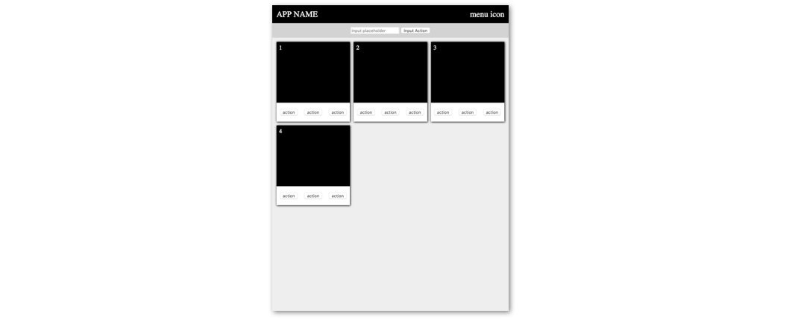

# Grid-Based Web App



#### Summary and Objective
For this exercise you will modify a grid-based template by customizing the style, content, and icons--building on your intuition about HTML/CSS and patterns of user interface design. You can choose a purpose and theme for the application, for example you could design it as a "To-Do List App". While your application will not be dynamic without any Javascript programming and database, you can create the look and feel with HTML and CSS.

## Instructions

### 1 Get the Template Code
Fork (copy) the template code on repl.it [found here](https://repl.it/@jimlyst/Grid-Based-Web-App-Template).

### 2 Link the Font Awesome Icon Library
The [Font Awesome] (https://fontawesome.com) library of icons is a great resource for adding icons to your web apps. First we need to link the style sheet in your HTML file by adding the following line inside the `head` element.

```html
<link href="https://use.fontawesome.com/releases/v5.7.2/css/all.css" rel="stylesheet">
```

Once you have linked this style sheet you are set use the icons. You can [search the icon gallery] (https://fontawesome.com/icons?d=gallery) and copy the appropriate HTML element, like the *star* icon below, to include it in your page.

```html
<i class="far fa-star"></i>
```

You will notice that the grayed out icons on Font Awesome are premium icons that you would have to pay for, but there are pleny of useful free icons you can use.

### 3 Add Icons to Your Interface
Add at least three unique icons in places you think it would make sense for your theme and application purpose. You may choose to let the icons stand alone or use them with a text description. You will likely want to use some icons for the buttons.

### 4 Style the Application as You Wish and Insert Conent
Style the application as you wish according the the theme and purpose of your application. Provide enough content in the list of items to provide a realistic view of what the application would look like with a fully functioning program and database.

Make at least the following additions or changes.
- Provide an app name appropriate for the theme and purpose of the application concept.
- Use at least one custom font, like we have before using Google Fonts.
- Change the color scheme of the application.
- Update the sizing, grid spacing, number of columns, and break-points (for mobile view) for the collection of items.
- Incorporate at least three unique icons.

### That's it. Hope you enjoyed making this interface and had some fun with it.

- Provide content that gives a realistic feel for the application theme and purpose.
